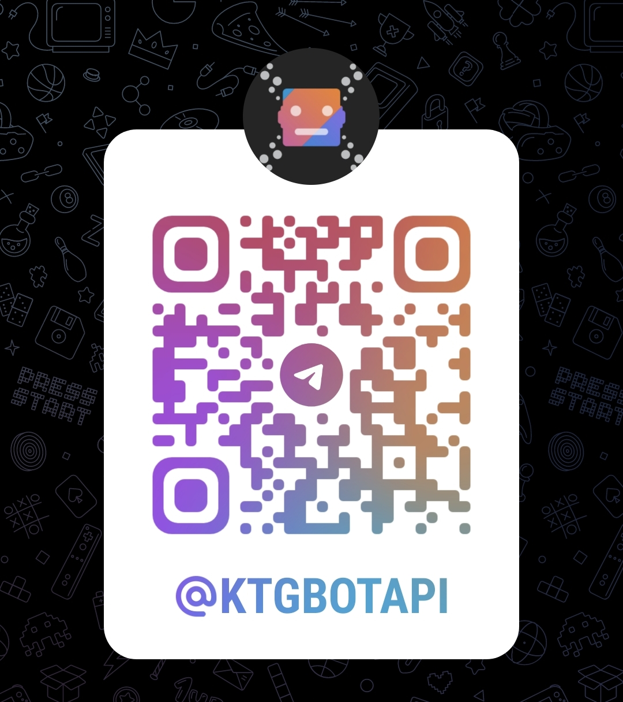

# TelegramBotAPI [](https://maven-badges.herokuapp.com/maven-central/dev.inmo/tgbotapi) [](https://core.telegram.org/bots/api-changelog#february-12-2025)

|          Docs          |                                   [](https://tgbotapi.inmo.dev/index.html) [](https://docs.inmo.dev/tgbotapi/index.html)                                    |
|:----------------------:|:-------------------------------------------------------------------------------------------------------------------------------------------------------------------------------------------------------------------------------------------------------------------------------------------------------------------------------------------------------------------------------------------------------:|
|      Useful repos      |                           [](https://github.com/InsanusMokrassar/TelegramBotAPI-bot_template/generate) [](https://github.com/InsanusMokrassar/TelegramBotAPI-examples/)                           |
|          Misc          |                              [](https://github.com/KotlinBy/awesome-kotlin) [](https://docs.google.com/forms/d/e/1FAIpQLSctdJHT_aEniyYT0-IUAEfo1hsIlezX2owlkEAYX4KPl2V2_A/viewform?usp=sf_link)                               |
|       Platforms        |                                                                                                                                                                                                              |
| Experimental Platforms |                                                                                                [](https://kotlinlang.org/docs/native-target-support.html#tier-1) [](https://kotlinlang.org/docs/native-target-support.html#tier-1)                                                                                                 |

<!--- [](https://t.me/ktgbotapi) --->

<p align="center">
  <a href="https://t.me/ktgbotapi">
    
  </a>
</p>

Hello! This is a set of libraries for working with Telegram Bot API.

## Examples

There are several things you need to do to launch examples below:

* Add `mavenCentral()` to your project repositories
    * [Maven variant](https://github.com/InsanusMokrassar/TelegramBotAPI/wiki/Including-in-your-project#pomxml)
* Add dependency `implementation "dev.inmo:tgbotapi:$tgbotapi_version"` 
    * Replace `tgbotapi_version` with exact version (see last one in the table above) or put variable with this name in project
    * Alternative variant for maven [here](https://github.com/InsanusMokrassar/TelegramBotAPI/wiki/Including-in-your-project#telegrambotapi)

More including instructions [available here](https://github.com/InsanusMokrassar/TelegramBotAPI/wiki/Including-in-your-project).
Other configuration examples:

* [For multiplatform](https://github.com/InsanusMokrassar/TelegramBotAPI-examples/tree/master/ResenderBot)
* [For JVM](https://github.com/InsanusMokrassar/TelegramBotAPI-examples/blob/master/GetMeBot/build.gradle)

### Most common example

```kotlin
suspend fun main() {
  val bot = telegramBot(TOKEN)

  bot.buildBehaviourWithLongPolling {
    println(getMe())
  
    onCommand("start") {
      reply(it, "Hi:)")
    }
  }.join()
}
```

In this example you will see information about this bot at the moment of starting and answer with `Hi:)` every time it
gets message `/start`

### Handling only last messages

```kotlin
suspend fun main() {
  val bot = telegramBot(TOKEN)

  val flowsUpdatesFilter = FlowsUpdatesFilter()
  bot.buildBehaviour(flowUpdatesFilter = flowsUpdatesFilter) {
    println(getMe())
  
    onCommand("start") {
      reply(it, "Hi:)")
    }

    retrieveAccumulatedUpdates(this).join()
  }
}
```

The main difference with the previous example is that bot will get only last updates (accumulated before bot launch
and maybe some updates it got after launch)

### Build a little bit more complex behaviour

```kotlin
suspend fun main() {
  val bot = telegramBot(TOKEN)

  bot.buildBehaviourWithLongPolling {
    println(getMe())

    val nameReplyMarkup = ReplyKeyboardMarkup(
      matrix {
        row {
          +SimpleKeyboardButton("nope")
        }
      }
    )
    onCommand("start") {
      val photo = waitPhoto(
        SendTextMessage(it.chat.id, "Send me your photo please")
      ).first()

      val name = waitText(
        SendTextMessage(
          it.chat.id,
          "Send me your name or choose \"nope\"",
          replyMarkup = nameReplyMarkup
        )
      ).first().text.takeIf { it != "nope" }

      sendPhoto(
        it.chat,
        photo.mediaCollection,
        entities = buildEntities {
          if (name != null) regular(name) // may be collapsed up to name ?.let(::regular)
        }
      )
    }
  }.join()
}
```

### More examples

You may find examples in [this project](https://github.com/InsanusMokrassar/TelegramBotAPI-examples). Besides, you are
always welcome in our [docs](https://docs.inmo.dev/tgbotapi/index.html) and
[chat](https://t.me/InMoTelegramBotAPIChat).
